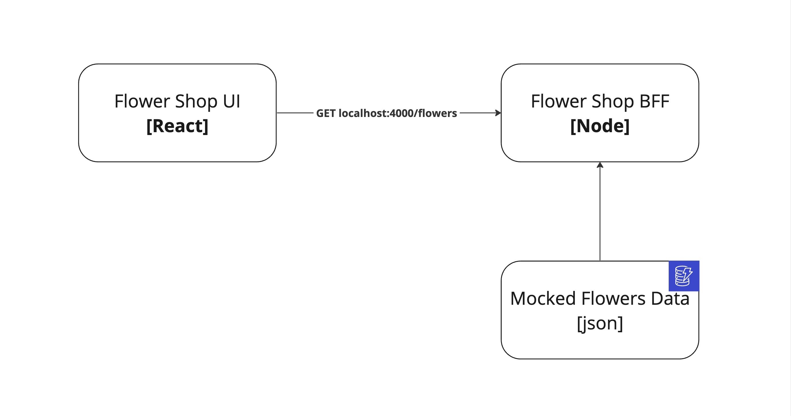

# Flower Shop App with React Testing Library

Welcome to the Flower Shop App repository! This project has been created with the aim of providing a practical guide for individuals interested in learning how to effectively test a React application using React Testing Library.

## About the project

This project centers around a simple flower shop, where visitors can explore a wide selection of flowers and put their React Testing Library skills into action. Here's what you can expect from this project:

- Browse through a wide selection of beautiful blooms
- Show your appreciation for the flowers by liking them
- Easily filter through the flower inventory

This project serves as a simple hands-on experience for React testing novices. By working on this Flower Shop app, you'll gain practical insights into testing React components effectively, ensuring your applications are robust and bug-free. As a bonus, since I'm a big fan of test-driven development (TDD), you will learn firsthand experience using TDD too (woo 😉)

## Architecture of the Flower Shop App

The architecture is pretty simple. The app is composed of:

- The Flower Shop front end
- The Flower Shop BFF (a simplified version) which returns mocked data for flowers in json format

## Getting started

To get started with this project, follow these simple steps:

1. Clone this repository to your local machine
1. Navigate to `/server` and follow the [server's ReadMe](./server/README.md) to start the back end.
1. Navigate to `/client` and follow the [client's ReadMe](./client/README.md) to start the front end.
1. Start exploring and testing the app as you follow along with the [Getting Started Guide](./docs/getting-started.md).

I hope you find this project enjoyable and educational. Happy coding!

## Resources

- [The React Testing Library Bootcamp - The Developer Guide](https://www.udemy.com/course/the-react-testing-library-bootcamp/) is an excellent Udemy course that I highly recommend to anyone wanting to learn more about React Testing Library. Throughout the project, I have used a lot of the content I learnt from the course!
- Beautiful photos of flowers were taken from [Unsplash](https://unsplash.com/)
