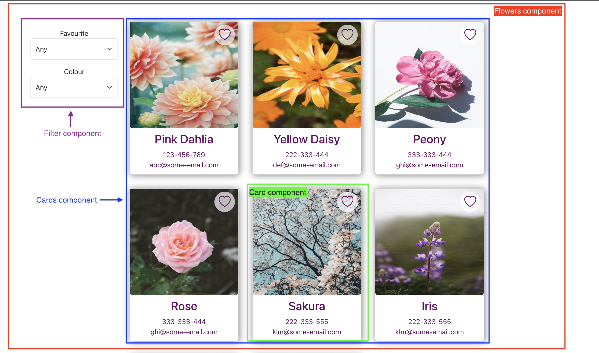

# The Flower App Client

To be filled later.

## Getting started

To get started with this project, follow these simple steps:

1. Clone this repository to your local machine
1. Install the required dependencies using `npm install`
1. Run the app using `npm start`
1. Start exploring and testing the app as you follow along with the guide. List of available scripts are detailed in the next section.

I hope you find this project enjoyable and educational. Happy coding!

## Available scripts

In the project directory, you can run:

### `npm start`

Runs the app in the development mode. Open [http://localhost:3000](http://localhost:3000) to view it in your browser. The page will reload when you make changes. You may also see any lint errors in the console.

### `npm test`

Launches the test runner in the interactive watch mode.

### `npm run build`

Builds the app for production to the `build` folder. It correctly bundles React in production mode and optimizes the build for the best performance. The build is minified and the filenames include the hashes. The app is now ready to be deployed!

## Structure of the React components

When working with React apps, my typical approach involves **breaking down the page into smaller components**. Subsequently, I determine how these components should interact and integrate with one another. This approach helps me figure out how I should write the tests for them first. I'm a fan of test-driven development (TDD), remember? 😆

Below is the component structure of the app.

- Typically, the `Card` component includes a single flower card.
- This card is then wrapped inside a collection of `Cards`
- `Filter` component includes the two dropdown lists that allow the user to select different filtering options.
- Wrapping both `Filter` and `Cards` is the overarching `Flowers` component. I refer to this component as the parent component of `Filter` and `Cards` because it has the responsibility of liaising or connecting the two components e.g. The user selects to filter by favourite, the cards should be updated accordingly.

